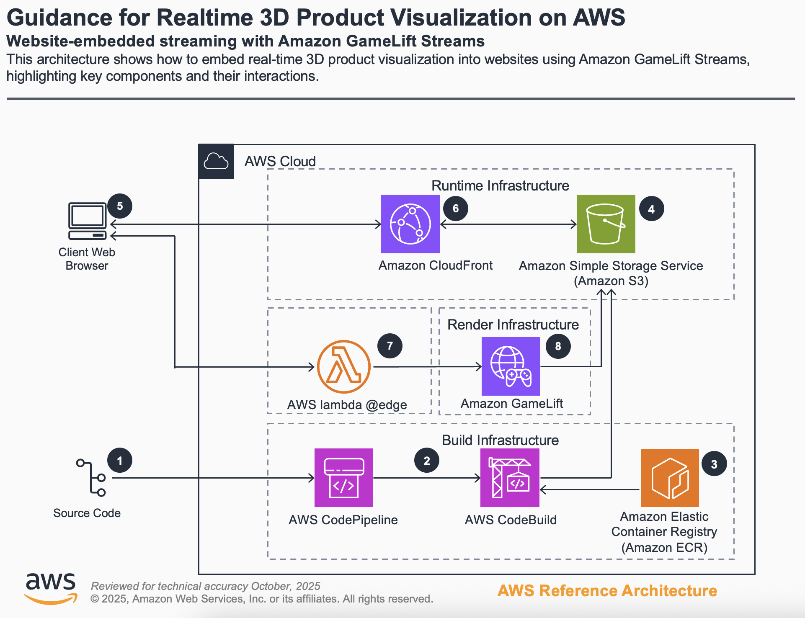
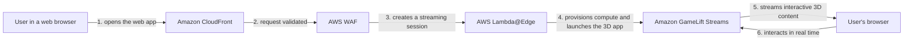

tagline: Interactive 3D product experiences streamed from the cloud to any web browser, with nothing to install.
tags: 3D, streaming, GameLift Streams, serverless

## Story

Showing a product in interactive 3D usually asks a lot of the viewer. Rendering a detailed model needs a powerful graphics card and a dedicated application on the device, so many customers never get past the download or simply do not have hardware that can keep up. That puts a real barrier between a product and the people who want to explore it.

This demo removes the barrier by moving the rendering to the cloud. Amazon GameLift Streams runs the 3D application on GPU-backed compute and streams the interactive picture to the browser, so a phone, a laptop or a meeting-room display can rotate, zoom and configure a product in real time with no plugin or installation. The viewer opens a link and starts interacting.

The demo is a complete, working example rather than a sketch. It ships a web front end that starts a streaming session for each visitor, the backend that hosts the 3D application, and a delivery pipeline that rebuilds and republishes the application whenever it changes. It shows how GameLift Streams fits into an ordinary web application and how the whole thing scales with demand.

## Architecture

1. The user opens the web application through Amazon CloudFront.
2. AWS WAF validates the request and applies its security rules.
3. An AWS Lambda@Edge function creates a streaming session with Amazon GameLift Streams.
4. Amazon GameLift Streams provisions compute resources and launches the 3D application.
5. The application streams interactive 3D content back to the user's browser.
6. The user interacts with the 3D product in real time through the browser.

